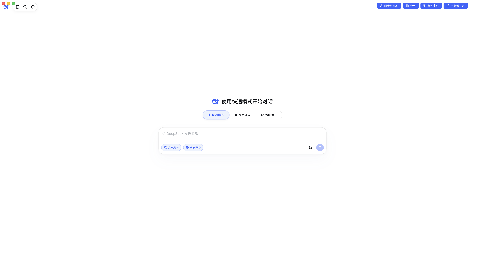

# dsbridge

**DeepSeek 桌面版对话 → 本地 jsonl → OpenClaw 按需读取**

在 DeepSeek 网页版（Pake 打包的 macOS 桌面 App）里自动保存你与 DeepSeek 的对话到本地文件，供 OpenClaw（或其他工具）随时读取、衔接续聊。

<p align="center">
  
</p>

> ⚠️ **平台说明：目前仅支持 macOS。**
> 本项目针对 macOS 的 WKWebView 行为和 `security`/`launchd` 命令编写。
> - 证书信任使用 `security add-trusted-cert`（macOS 专用）
> - 自启服务使用 `launchd`（macOS 专用）
> - Pake 的注入脚本在 Windows（WebView2）/Linux（WebKitGTK）上的混合内容行为未验证
>
> 如需其他平台支持，需调整证书信任与自启机制。

## 为什么做这个

- DeepSeek 网页版免费，适合多轮深度咨询
- 对话自动归档到**你自己硬盘**，不依赖 DeepSeek 服务器
- OpenClaw 可读取这些对话继续处理（续聊、总结、执行），省 token（缓存命中率高）
- 敏感内容聊完即落本地，减少第三方留存

## 架构

```
[DeepSeek Pake 桌面版 (macOS)]
   │  注入 deepseek_inject.js（自动同步 + 3 个按钮）
   │  https POST 对话内容（自签证书，已加入系统信任）
   ▼
[bridge.js]  ← Node 本地桥（launchd 常驻，127.0.0.1:8787）
   │  追加写入（同日按 content 去重）
   ▼
[data/YYYY-MM-DD.jsonl]  ← 对话原文，按天拆分
   │  OpenClaw 需要时读取
   ▼
[OpenClaw 继续对话]
```

## 文件说明

| 文件 | 作用 |
|---|---|
| `bridge.js` | Node 本地桥：接收对话，写入 jsonl（HTTPS 8787 主 / HTTP 8786 备用） |
| `deepseek_inject.js` | Pake 注入脚本：自动同步 + 同步/导出/复制按钮（SVG 图标） |
| `pack_deepseek.sh` | 一键打包脚本：unset CC/CXX → 生成/信任证书 → 安装服务 → 打包 |
| `com.dax.dsbridge.plist` | launchd 服务模板（`__DSBRIDGE_DIR__` 占位符，安装时替换） |
| `cert.pem` / `key.pem` | 自签证书（**不入库**，首次由脚本生成） |
| `data/` | 对话数据（**不入库**，按天 jsonl） |

## 快速开始

### 0. 前置条件（macOS）

- **Node.js ≥ 18**（本地桥运行时；Homebrew：`brew install node`）
- **Pake**（打包工具；Homebrew：`brew install pake`）
- **OpenSSL**（首次生成自签证书；macOS 自带，一般无需安装）

### 1. 一键打包（推荐）

```bash
cd ~/codes/dsbridge
./pack_deepseek.sh
```

脚本自动完成：

1. unset `CC`/`CXX`（避免干扰 Pake 的 Rust 编译）
2. 生成自签名证书（如不存在）；加入系统信任（**首次需输入管理员密码**）
3. 安装并启动 launchd 服务 `com.dax.dsbridge`（登录自启、崩溃自动拉起）
4. 用 Pake 打包 DeepSeek App 并安装到 `/Applications`

### 2. 手动启动本地桥（不打包时）

```bash
node bridge.js
# [dsbridge] HTTPS 监听 https://127.0.0.1:8787
# [dsbridge] HTTP  监听 http://127.0.0.1:8786（备用）
```

服务管理：

```bash
launchctl list | grep dsbridge                          # 状态
launchctl kickstart gui/$(id -u)/com.dax.dsbridge      # 重启
launchctl bootout gui/$(id -u)/com.dax.dsbridge        # 停止
```

### 3. 使用

- 正常和 DeepSeek 聊天即可，**新消息自动静默同步**（内容稳定约 3 秒后保存）
- 手动按钮（兜底）：
  - **同步到本地**：立即保存当前对话
  - **导出**：下载 Markdown 文件
  - **复制全部**：复制对话到剪贴板
- 对 OpenClaw 说："读一下我今天的 DeepSeek 对话" / "接着我和 DeepSeek 聊的 XX 话题继续"

## 数据格式

`data/YYYY-MM-DD.jsonl`，每行一条 JSON：

```json
{"ts":"2026-08-03T05:39:00.000Z","role":"user","content":"问题内容"}
{"ts":"2026-08-03T05:39:05.000Z","role":"assistant","content":"回答内容"}
```

## 环境变量

| 变量 | 默认 | 说明 |
|---|---|---|
| `DSBRIDGE_PORT` | `8787` | HTTPS 端口 |
| `DSBRIDGE_HTTP_PORT` | `8786` | HTTP 备用端口 |
| `DSBRIDGE_DATA_DIR` | `./data` | 数据目录 |
| `DSBRIDGE_HOST` | `127.0.0.1` | 监听地址 |

## 技术要点

- **为什么需要本地桥**：Pake 的 WebView 是沙箱，注入的 JS 没有文件系统权限，但可以发 HTTP 请求到 `127.0.0.1`。bridge.js 就是这个"信使"。
- **为什么用 HTTPS**：WKWebView 默认阻止 https 页面加载 http 资源（混合内容），实测 `TypeError: Load failed`。给桥套自签 HTTPS 后页面→桥均为 https，不再拦截；证书需加入系统信任（`security add-trusted-cert`）。
- **为什么不用反向代理**：反向代理只用于"把 OpenClaw webchat 嵌进 DeepSeek 窗口"的场景；本项目方向相反（抓对话内容出来），不需要。
- **去重**：同一天内相同 content 只写一次。
- **防误发**：轮询检测新消息，连续 2 轮（约 3 秒）内容不变才认为写完，避免保存流式输出的半截内容。

## 安全说明

- 对话落到本地文件后由你自己掌控
- DeepSeek 侧存在跨用户缓存泄露风险（如 `<think` 标签漏洞，GitHub issue #840、CVE-2026-55604），**敏感信息谨慎输入**
- 自签证书私钥 `key.pem` 不入库，仅本机使用

## License

MIT
